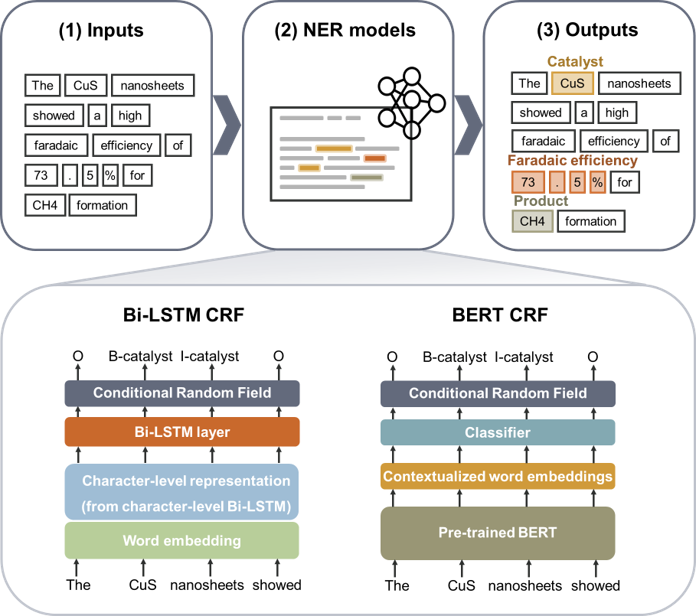
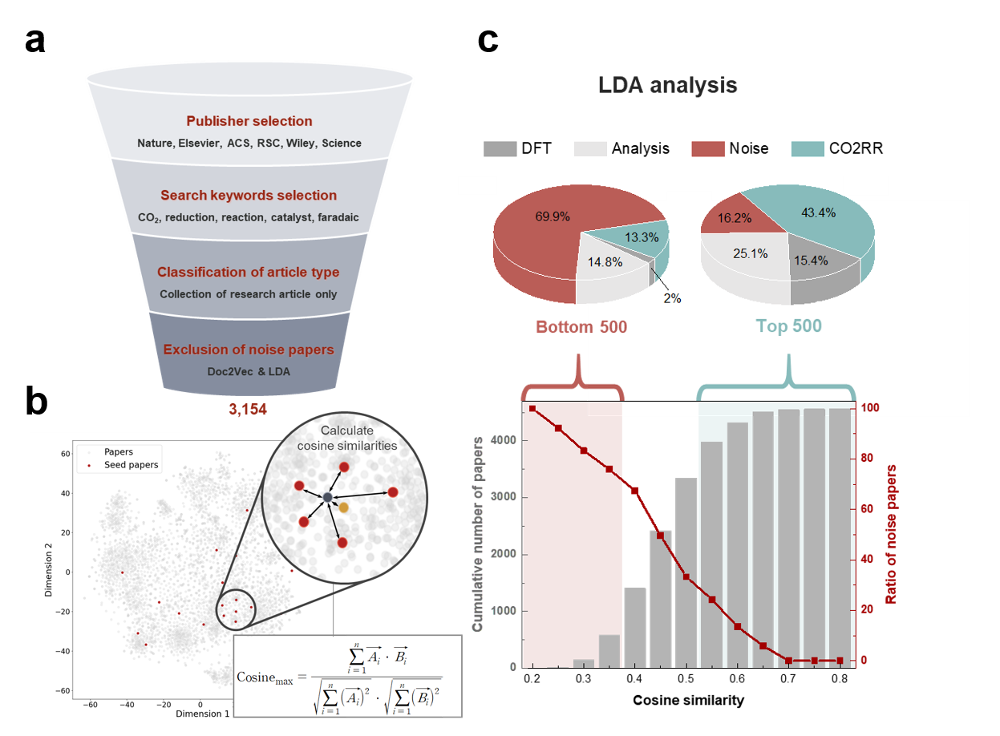

# CO2RR Named Entity Recognition (NER)

## Introduction
### 1) Model structures for named entity recognition (NER) 
<p align="center">
  
</p>

### 2) Exclusion of noise papers using Doc2vec and latent dirichlet allocation (LDA) 
<p align="center">
  
</p>

Two techniques are needed to automatically extract data from the literature and utilize the extracted data. The first is a technology to selectively classify only the papers we want through preprocess of paper, and the second is a technology, called NER, to automatically extract information from the literature.
Therefore, This repository contains how to exclude noise paper from corpus (paper preprocess) and CO2 reduction reaction (CO2RR) NER models (BERT, Bi-LSTM) that classify words in literature into predefined classes, such as catalyst and product.

## 1. Paper preprocess

### 1) Installation

**Using conda**
```bash
conda env create -f conda_requirements_paper.yaml
```
**Using pip**
```bash
pip install -r requirements_paper.txt
```
### 2) Download data files
```
git clone https://github.com/KIST-CSRC/CO2RR_NER.git
git lfs pull
```
### 3) Code usage
**Examples: Train Doc2vec**
> ```python
> from gensim.models.doc2vec import Doc2Vec,TaggedDocument
> from chemdataextractor.doc.text import Text
> from chemdataextractor.nlp.tokenize import ChemWordTokenizer
> import os
> import time  
> import numpy as np
> from Paper_preprocess.Doc2vec import DocumentVector
>
> path_dir = 'your_corpus_path'
> documentvector = DocumentVector()
> documentvector.run(path_dir)
> print(time.strftime('%c', time.localtime(time.time())))  
> ```

**Examples: Train LDA**
>```python
> from gensim.models.ldamodel import LdaModel
> from chemdataextractor.doc.text import Text
> from chemdataextractor.nlp.tokenize import ChemWordTokenizer
> import os
> import time  
> import pickle
>
> from nltk.corpus import stopwords 
> from gensim import corpora
> import pandas as pd
> import csv
> import pyLDAvis
> import pyLDAvis.gensim_models
>
> from gensim.models.coherencemodel import CoherenceModel 
> import matplotlib.pyplot as plt
> import warnings
> 
> import nltk
> nltk.download('averaged_perceptron_tagger')  
> from Paper_preprocess.Lda import Lda
>
> path_dir = 'your_corpus_path'
> lda_obj = Lda()
> lda_obj.run(path_dir)
>
> print(time.strftime('%c', time.localtime(time.time())))
> ```

**Examples: Calculate cosine similarity**
1) Load the trained doc2vec model into your corpus.
2) Set seed papers that are examples of papers you want to selectively collect.
3) Calculate the cosine similarity of each paper using Calculate_cosine_similarity.py
   
**Finally, the noise paper can be removed using the calculated cosine similarity and lda result. Please refer to this paper for details**


## 2. CO2RR NER (BERT_CRF)

### 1) Installation

**Using conda**
```bash
conda env create -f conda_requirements_ner.yaml
```
**Using pip**
```bash
pip install -r requirements_ner.txt
```

### 2) Download data files
```
git clone https://github.com/KIST-CSRC/CO2RR_NER.git
git lfs pull
```

The MatBERT model retrained with CO2RR was large, so it was uploaded using **large file storage (LFS)**. Therefore, the **"git lfs pull"** command is absolutely necessary.

### 3) Pre-trained Model

Please ensure that after set up the directories as follows:
```
BERT_CRF
├── best_model
│   └── .gitattributes
│   └── best.pt
├── dataset
│   └── examples of data (such as new_IOBES_bert_base_cased.csv)
├── models
│   └── base_ner_model.py
│   └── bert_model.py
│   └── crf.py
├── predict
│   └── dataset
│       └── ACS_CO2RR_00343.csv
│       └── ACS_CO2RR_00343.json
├── utils
│   └── data.py
│   └── metrics.py
│   └── post_process.py
└── predict.py
└── run.py
```

### 4) Code usage
Model pretrainig and finetuning is done by modifying the code opensourced by [MatBERT_NER](https://github.com/lbnlp/MatBERT_NER) authors to suit our work.


**Examples: Re-train BERT model**

The code below is part of the **run.py file**. After modifying the parameters of the corresponding part as you want, if you run the run.py file, learning will proceed.
>```python
>n_epochs = 100
>full_finetuning = True
>savename = time.strftime("%Y%m%d")
>
>device = "cuda:1"
>models = {'bert_base': 'bert-base-cased',
>          'scibert': 'allenai/scibert_scivocab_cased',
>          'matbert': './matbert-base-cased',
>          'matscibert' : 'm3rg-iitd/matscibert',
>          'bert_large' :'bert-large-cased'}
>
>splits = {'_80_10_10': [0.8, 0.1, 0.1]}
>
>
>label_type = 'BERT'
>tag_type = 'IOBES'
># 0: exclude structure entities.
>structure = '1'
>batch_size = 32
>k_fold = 10
>datafile = f"./dataset/new_{tag_type}_matbert_cased.csv"
>
>for alias, split in splits.items():
>   # If you want to change the model you want to retrain, edit this part
>    for model_name in ['matbert']:
>```

**Examples: Predicting samples**

1. Like a file in the "predict/dataset/.." path,
prepare two data files in csv and json format.
2. Run predict.py

## CO2RR NER (Bi-LSTM CRF)
We also used the Bi-LSTM CRF as the NER model and compared the performance of the BERT CRF model. For more details, see the paper below. Download the **Bi-LSTM CRF code** [here](https://drive.google.com/drive/folders/1A6QvVtUFr7CV0qduUpRiogfhTyDr7GVt?usp=share_link).

## Reference
For more details, see the paper below.
Please cite us if you are using our model in your research work: <br />

  [1] Our paper
